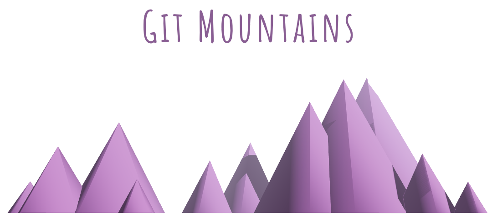

[](https://app.netlify.com/sites/git-mountains/deploys)



**Git Mountains** is a web app that visualises a user's GitGub commit history as a three-dimensional mountain range.

Use the deployed app here: [https://git-mountains.netlify.app/](https://git-mountains.netlify.app/)

## Key technologies

- React Three Fibre
- Next.js

## Development

The app is built with Next.js on Node v21.1.0

You can get started with the following commands:

```bash
# Download and install the project locally:
git clone https://github.com/empowermint/git-mountains
cd git-mountains
npm install

# Create local environment variables:
cp .env.example .env.local
# Fill in the file according to the instruction contained within

# Start a local development server:
npm run dev
```
